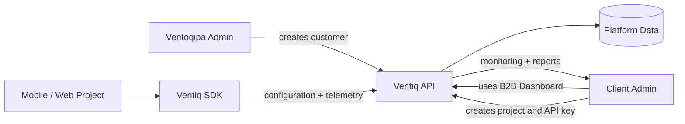
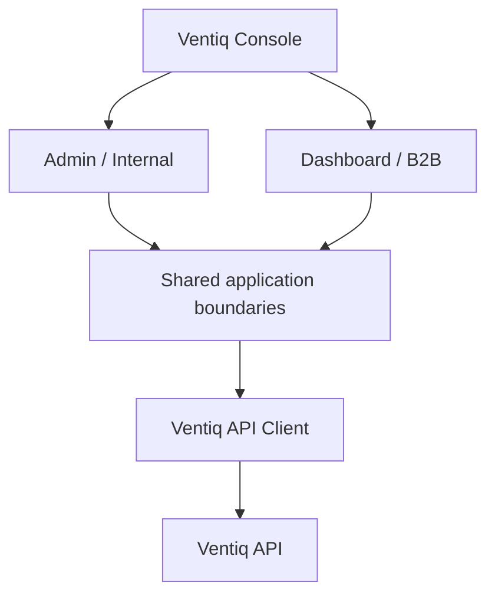
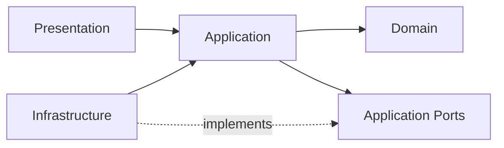

# Ventiq Console

Ventiq Console is the web control plane for the Ventiq advertising platform.

It serves two experiences from one React application:

- **Ventiq Admin** — internal Ventoqipa operations for customer onboarding and account administration.
- **Ventiq Dashboard** — B2B customer workspace for projects, API keys, ad configuration, placements, monitoring, and reporting.

The Console consumes a **single Ventiq API** shared by Admin, Dashboard, and Ventiq SDK clients.

> This repository is intentionally a foundation, not a completed solution. The trainee is expected to implement product use cases and justify architecture decisions.

## Product flow



## Console boundaries



## Clean Architecture direction

Dependencies should point inward. UI and infrastructure details must not own business rules.



### Layer intent

- **Domain**: product concepts and business rules without React or HTTP dependencies.
- **Application**: use cases and ports required by those use cases.
- **Infrastructure**: HTTP/API implementations, browser adapters, persistence adapters.
- **Presentation**: routes, pages, components, view state, and user interaction.
- **Shared**: cross-cutting primitives only when they are genuinely shared.

Do not create abstractions only to satisfy a folder structure. Prefer cohesive features and explicit dependencies.

## Initial milestone

The first vertical slice is the internal Ventoqipa Admin:

```
Login
  -> Admin shell
  -> Customers
  -> Create customer
  -> Customer detail
  -> Create client administrator
  -> Activate / suspend customer
```

The next milestone introduces the B2B customer flow:

```
Client login
  -> Project
  -> Platform
  -> Generate / rotate / revoke API key
  -> SDK integration
  -> Ads configuration
  -> Monitoring
```

## Repository structure

```
src/
  app/                  # composition root, routing, providers
  domain/               # enterprise/product rules
  application/          # use cases and ports
  infrastructure/       # external implementations
  presentation/         # admin + dashboard UI
  shared/               # truly shared UI/types/utilities
docs/
  architecture/
  adr/
  product/
.github/
  workflows/
```

See [Architecture](docs/architecture/ARCHITECTURE.md) and [Product Flow](docs/product/PRODUCT_FLOW.md).

## Tech stack

- React
- TypeScript
- Vite
- React Router
- Vitest + Testing Library
- ESLint
- AWS Amplify Hosting

Node.js 20+ is recommended.

## Local development

```bash
npm install
cp .env.example .env.local
npm run dev
```

The API base URL is configured with:

```env
VITE_API_BASE_URL=http://localhost:8080/v1
```

No provider secrets, private API keys, or server credentials belong in Vite environment variables. Browser variables are public to the built application.

## Quality commands

```bash
npm run lint
npm run typecheck
npm run test
npm run build
```

## AWS Amplify Hosting

The repository includes `amplify.yml` for Amplify Hosting.

Recommended setup:

1. Create an Amplify Hosting application and connect this GitHub repository.
2. Use `main` as the production branch.
3. Configure `VITE_API_BASE_URL` in Amplify environment variables.
4. Keep secrets in the API/backend, never in the Console.
5. Deploy. Amplify will use the repository build specification.
6. Configure the SPA rewrite so application routes resolve to `index.html`.

Build output: `dist/`.

### SPA rewrite

In Amplify Hosting, configure a rewrite equivalent to:

```
Source: </^[^.]+$|\.(?!(css|gif|ico|jpg|js|png|txt|svg|woff|woff2|ttf|map|json)$)([^.]+$)/>
Target: /index.html
Status: 200
```

Review AWS Amplify Hosting documentation if the platform changes its routing configuration.

## Security principles

- Ventoqipa creates the customer account.
- Customers create and manage SDK API keys from the B2B Dashboard.
- Human credentials and SDK credentials are different concepts.
- SDK secrets must not be confused with user passwords.
- Provider secrets remain server-side.
- Client-side authorization is a UX boundary only; the API must enforce authorization.
- Customer resources must be tenant-isolated by the API.
- Never commit credentials.

## Contribution rules

1. Start from a product problem or backlog item.
2. Identify the responsible layer.
3. Implement the smallest coherent vertical change.
4. Add or update tests.
5. Run lint, typecheck, tests, and build.
6. Explain architectural trade-offs in the PR.
7. Add an ADR only when a meaningful decision requires one.

### Review questions

- What problem does this solve?
- Why does this responsibility live here?
- What depends on it?
- What can change later?
- What do we gain?
- What complexity do we introduce?

AI may assist with implementation and research. The developer remains responsible for understanding, validating, testing, and explaining the result.

## Current status

Foundation only. Product use cases are intentionally not implemented yet.
