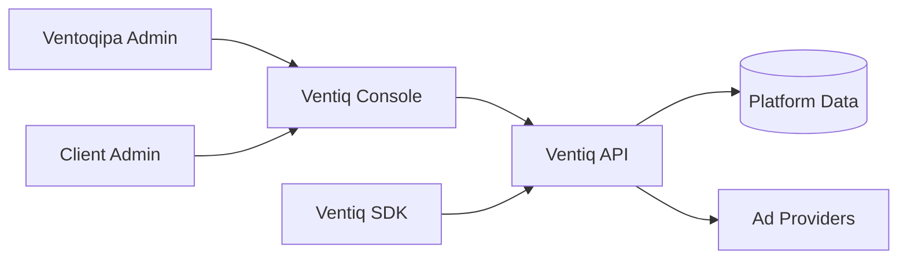
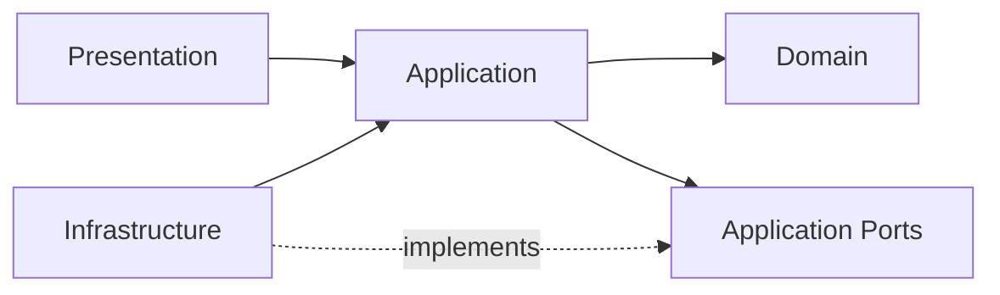
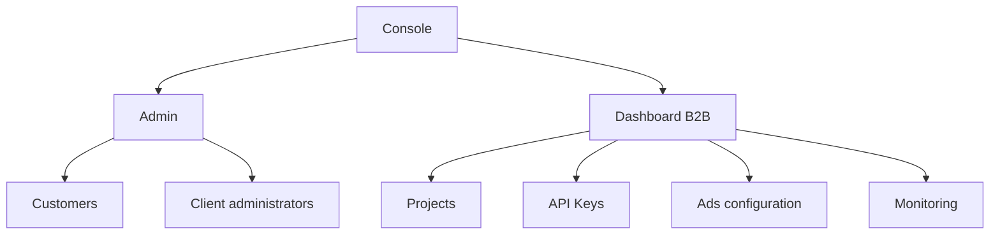

# Ventiq Console Architecture

## Context

Ventiq Console is one web application with two user-facing areas:

1. **Admin** for Ventoqipa internal operations.
2. **Dashboard** for B2B customers.

Both consume the same Ventiq API. The SDK also consumes that API independently; SDK implementation does not belong in this repository.

## Dependency rule

### Domain
Business concepts and invariants. No React, HTTP, browser, or vendor dependencies.

### Application
Use cases and ports. Coordinates domain behavior without knowing concrete infrastructure.

### Infrastructure
Concrete Ventiq API clients and external/browser adapters.

### Presentation
Routes, pages, layouts, components, and UI state for Admin and Dashboard.

## Product areas

## Architectural constraints

- Do not place business rules in React components.
- Do not call `fetch` directly from pages/components.
- Do not expose provider credentials or backend secrets.
- API authorization is authoritative; route guards are not security boundaries.
- Keep Admin and B2B responsibilities explicit.
- Prefer vertical delivery over creating every future folder in advance.
- Add abstractions because a dependency or variation requires them, not because a pattern exists.
