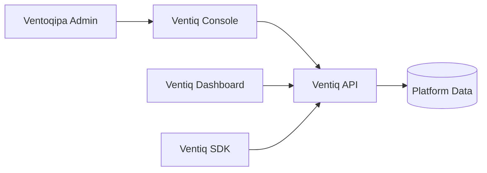
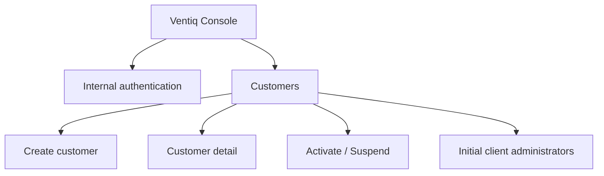
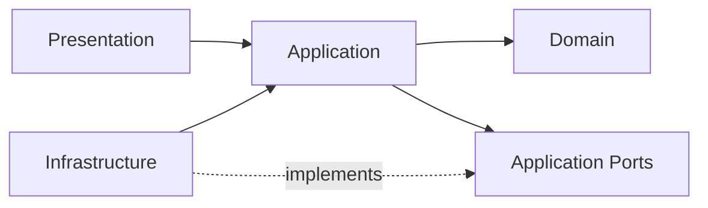

# Ventiq Console Architecture

## Responsibility

Ventiq Console is the **internal Ventoqipa administration application**. It is not the B2B customer Dashboard and it does not contain SDK or advertising-management features.

The Dashboard and SDK are shown only as platform context. They are separate projects.

## Console scope

## Dependency rule

### Domain
Internal administration concepts and business rules. No React, HTTP, browser, or vendor dependencies.

### Application
Admin use cases and required ports.

### Infrastructure
Concrete Ventiq API clients and browser adapters.

### Presentation
Internal routes, pages, layouts, components, and view state.

## Architectural constraints

- Do not place business rules in React components.
- Do not call external APIs directly from pages/components.
- Do not expose backend secrets.
- API authorization is authoritative; route guards are UX boundaries only.
- Do not add B2B Dashboard features to this repository.
- Do not add SDK code to this repository.
- Prefer vertical delivery over speculative structure.
