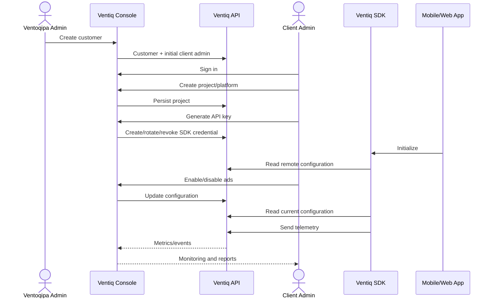

# Product Flow

## Actors

- **Ventoqipa Admin**: creates and manages customer accounts.
- **Client Admin**: manages the customer's projects, SDK API keys, advertising configuration, monitoring, and reports.
- **Ventiq SDK**: embedded in a mobile or web project. Reads configuration and sends telemetry.
- **Ventiq API**: single platform API serving Admin, B2B Dashboard, and SDK consumers.

## End-to-end flow

## Ownership

Ventoqipa creates the customer. The customer creates SDK credentials. The SDK never authenticates as a human user.
