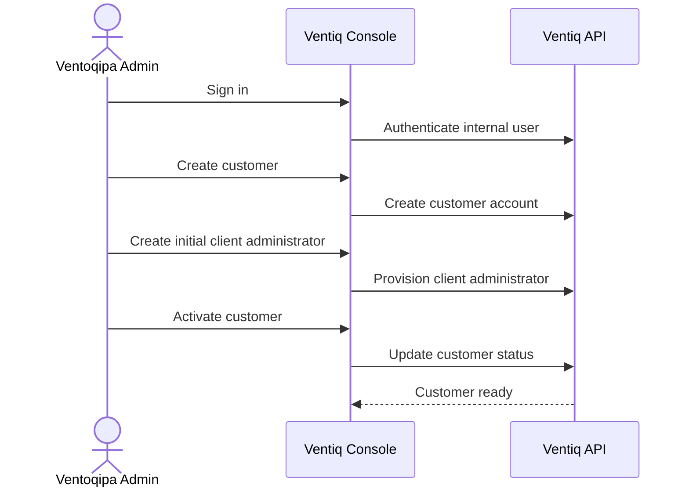
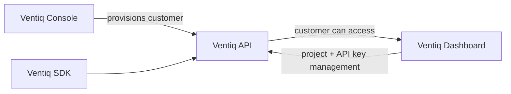

# Ventiq Console Product Flow

## Actor

**Ventoqipa Admin** is the only product actor for this repository.

The administrator onboards and manages Ventiq customers. Once a customer is provisioned, customer-facing operations continue in the separate Ventiq Dashboard.

## Console flow

## Platform handoff

The handoff is platform context only. Dashboard and SDK behavior are outside this repository.
